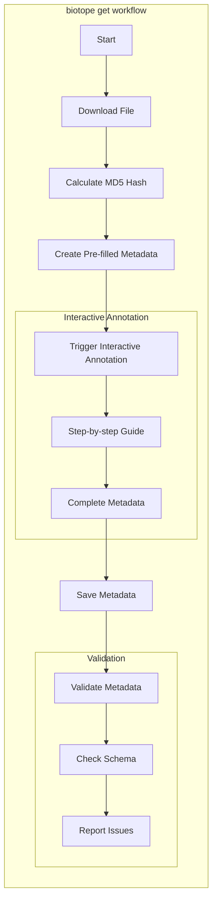

# Biotope Tutorials

Welcome to the Biotope tutorials! This guide will help you understand how to
work with Biotope for metadata annotation.

## Workflow Overview

The following diagram illustrates the main annotation workflow in Biotope:

## Workflow Description

The `biotope get` command provides a streamlined way to download files and annotate them with metadata:

1. **Download File**: Downloads the specified file from a URL
2. **Calculate MD5 Hash**: Generates a unique identifier for the file
3. **Create Pre-filled Metadata**: Automatically generates initial metadata based on the file
4. **Interactive Annotation**: Guides you through completing the metadata with a step-by-step process
5. **Save Metadata**: Stores the final metadata alongside your file
6. **Validation**: Checks the metadata against the schema and reports any issues

## Getting Started

To get started with Biotope, use `biotope get <url>` to download and annotate a
file in one step. This will guide you through the entire process from download
to validation.

For more detailed information about the command and its options, please refer
to the specific tutorial pages for [biotope get](get-files.md) and
[biotope annotate](annotate-omics.md).