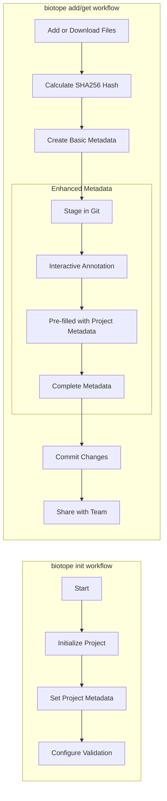

# Biotope Tutorials

Welcome to the Biotope tutorials! This guide will help you understand how to
work with Biotope for metadata annotation.

## Workflow Overview

Biotope supports multiple workflows for managing your data and metadata:

### Git-Integrated Workflow (Recommended)



### Workflow Description

The enhanced biotope workflow now includes project-level metadata management:

1. **Initialize Project**: Use `biotope init` to set up your project with optional project metadata
2. **Set Project Metadata**: Configure project-level metadata (description, URL, creator, license, citation) for annotation pre-filling
3. **Add or Download Files**: Add local files with `biotope add` or download remote files with `biotope get`
4. **Calculate SHA256 Hash**: Generate checksums for data integrity
5. **Create Basic Metadata**: Automatically generate initial Croissant ML metadata
6. **Stage in Git**: Prepare metadata changes for version control
7. **Enhanced Metadata**: Use `biotope annotate` to add detailed metadata with project metadata pre-fill
8. **Commit Changes**: Save metadata changes with Git
9. **Share with Team**: Use standard Git workflows for collaboration

## Getting Started

### For Local Files (Recommended)

To get started with local files, use the Git-integrated workflow:

```bash
# Initialize project with project metadata
biotope init

# Add local data files
biotope add data/raw/experiment.csv

# Annotate with project metadata pre-fill
biotope annotate interactive --staged

# Commit changes
biotope commit -m "Add experiment dataset"
```

### For Downloaded Files

To get started with downloaded files, use the download workflow:

```bash
# Initialize project (if not already done)
biotope init

# Download and stage files
biotope get https://example.com/data/file.csv

# Check status
biotope status

# Annotate with project metadata pre-fill
biotope annotate interactive --staged

# Commit changes
biotope commit -m "Add downloaded dataset"
```

### Project Metadata Management

Set up project-level metadata for consistent annotation:

```bash
# Set project metadata during init or later
biotope config set-project-metadata

# View current project metadata
biotope config show-project-metadata

# Use in annotation (automatically pre-filled)
biotope annotate interactive --staged
```

## Tutorials

For detailed information about each workflow, please refer to the specific tutorial pages:

- **[Adding Files](add-files.md)**: Learn how to add local files to your biotope project
- **[Downloading Files](get-files.md)**: Learn how to download and annotate files from URLs
- **[Annotating Data](annotate-omics.md)**: Learn how to create detailed metadata for your data with project metadata pre-fill