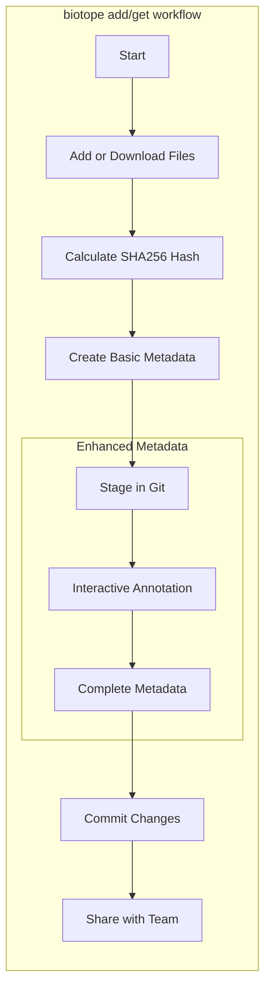

# Biotope Tutorials

Welcome to the Biotope tutorials! This guide will help you understand how to
work with Biotope for metadata annotation.

## Workflow Overview

Biotope supports multiple workflows for managing your data and metadata:

### Git-Integrated Workflow (Recommended)



### Workflow Description

The `biotope add` and `biotope get` commands are the foundation of Git-integrated metadata management:

1. **Add or Download Files**: Add local files with `biotope add` or download remote files with `biotope get`
2. **Calculate SHA256 Hash**: Generate checksums for data integrity
3. **Create Basic Metadata**: Automatically generate initial Croissant ML metadata
4. **Stage in Git**: Prepare metadata changes for version control
5. **Enhanced Metadata**: Use `biotope annotate` to add detailed metadata
6. **Commit Changes**: Save metadata changes with Git
7. **Share with Team**: Use standard Git workflows for collaboration

## Getting Started

### For Local Files (Recommended)

To get started with local files, use the Git-integrated workflow:

```bash
biotope init
biotope add data/raw/experiment.csv
biotope annotate interactive --staged
biotope commit -m "Add experiment dataset"
```

### For Downloaded Files

To get started with downloaded files, use the download workflow:

```bash
biotope get https://example.com/data/file.csv
biotope status
biotope annotate interactive --staged
biotope commit -m "Add downloaded dataset"
```

## Tutorials

For detailed information about each workflow, please refer to the specific tutorial pages:

- **[Adding Files](add-files.md)**: Learn how to add local files to your biotope project
- **[Downloading Files](get-files.md)**: Learn how to download and annotate files from URLs
- **[Annotating Data](annotate-omics.md)**: Learn how to create detailed metadata for your data